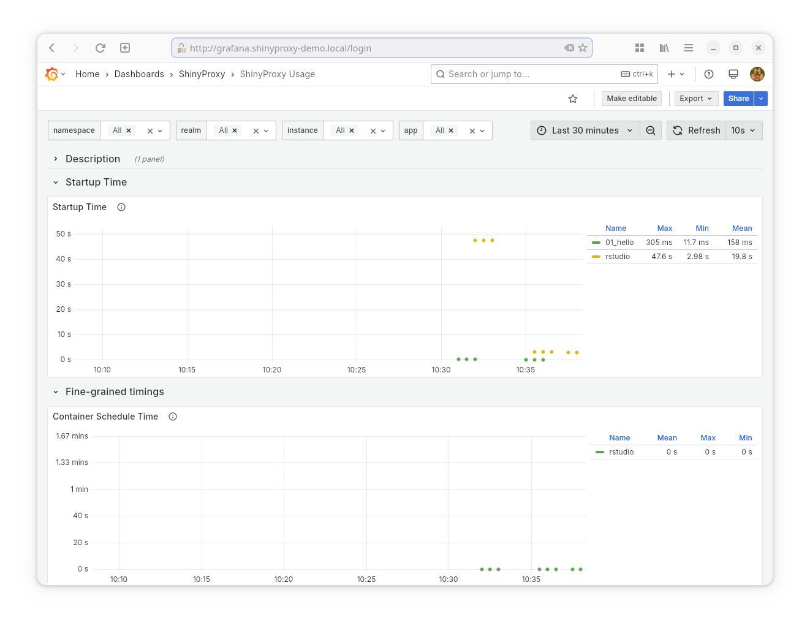
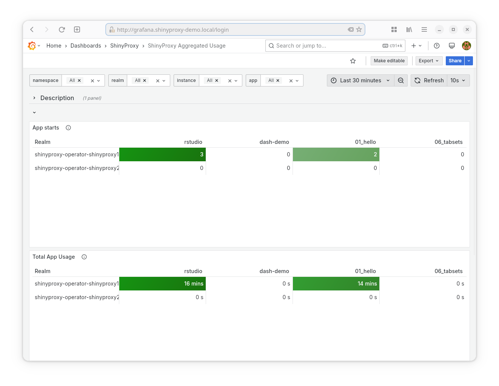
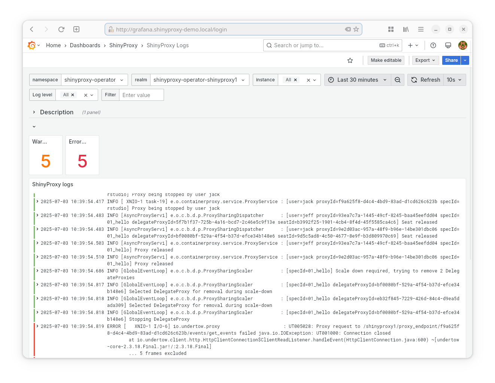
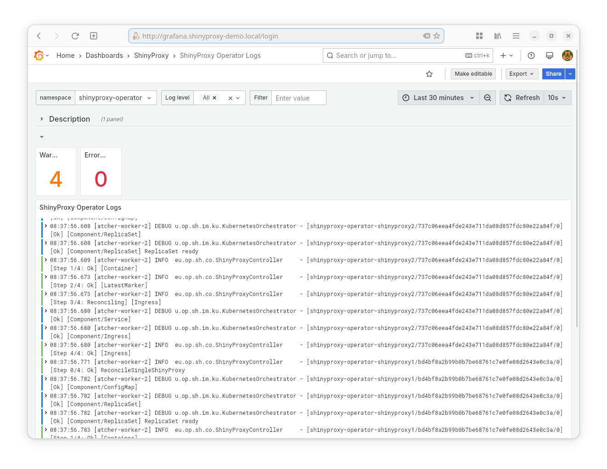
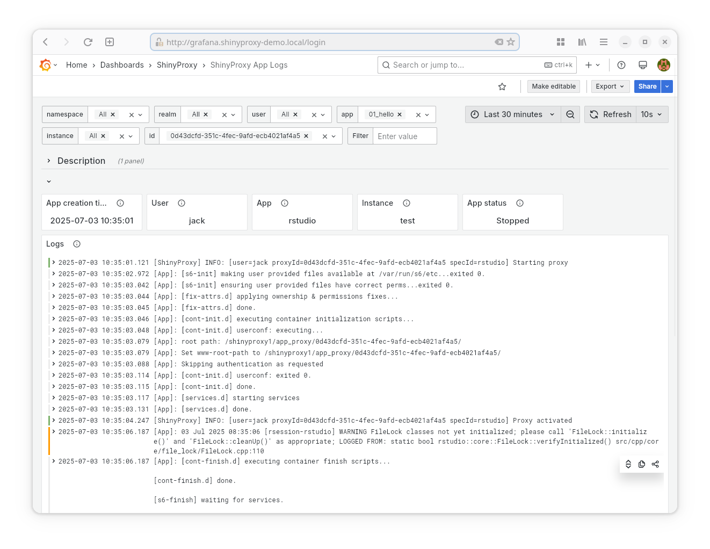
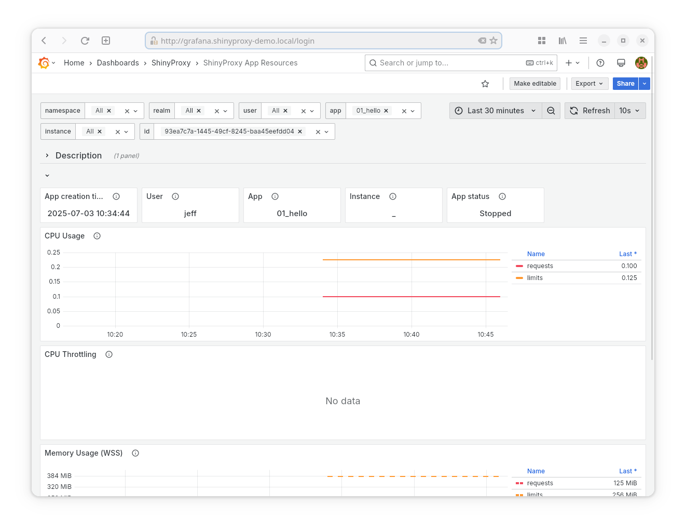

# ShinyProxy Monitoring

## Summary

This repository provides all resources required for setting up comprehensive
monitoring of ShinyProxy on Kubernetes. The setup uses Loki (together with
promtail) for collecting logs of ShinyProxy, the ShinyProxy Operator and any app
running in ShinyProxy. Prometheus is used for gathering metrics of ShinyProxy
and the apps (i.e. the resources used by the apps). The setup also includes
Grafana, together with **six** dashboards for visualizing all logs and metrics.

The retention of both Loki and Prometheus is set to 90 days.

## Overview of dashboards

### ShinyProxy Usage

**Screenshot:**

<details>


</details>

- **Datasource:** Prometheus
- **Goal:** provide inside in the *current* usage and performance of ShinyProxy.
- **Provided statistics**:
    - App Startup Time
    - App Usage Time
    - Number of running apps (per app name)
    - Number of logged-in users
    - Number of active users
    - Number of auth failures
    - Number of app start failures

**Note**: the next version of ShinyProxy will provide more detailed metrics for
the startup time. For example, the time it took to pull the Docker image, to
schedule the container etc.

### ShinyProxy Aggregated Usage

**Screenshot:**

<details>


</details>

- **Datasource:** Prometheus
- **Goal:** provide inside in the *long-term* usage and performance of
  ShinyProxy.
- **Provided statistics**:
    - Number of times an app has been started (per app)
    - The total time an app has been used (per app)
    - The average time an app is used (per app)

### ShinyProxy logs

**Screenshot:**

<details>


</details>

- **Datasource:** Loki
- **Goal:** show the logs of the ShinyProxy server
- **Provided statistics**:
    - Number of warnings
    - Number of errors

**Note:** promtail was set up such that it recognizes when Java outputs a stack
trace and therefore collects this as a single log message. We could improve and
optimize this by adding an option to ShinyProxy to log to JSON.

### ShinyProxy Operator Logs

**Screenshot:**

<details>


</details>

- **Datasource:** Loki
- **Goal:** show the logs of the ShinyProxy Operator
- **Provided statistics**:
    - Number of warnings
    - Number of errors

**Note:** promtail was set up such that it recognizes when Java outputs a stack
trace and therefore collects this as a single log message. We could improve and
optimize this by adding an option to ShinyProxy to log to JSON.

### ShinyProxy App Logs

**Screenshot:**

<details>


</details>

- **Datasource:** Loki
- **Goal:** show the logs of any app started by ShinyProxy.
- **Provided statistics**:
    - The time when the app was created. Combined with the filters, this should
      make it easier to find the correct container (id).

### ShinyProxy App Resources

**Screenshot:**

<details>


</details>

- **Datasource:** Prometheus
- **Goal:** show the resources (CPU, Memory, Network) used by any app started by
  ShinyProxy.
- **Provided statistics**:
    - Current CPU usage
    - CPU Limit and Requests
    - CPU Throttling
    - Current memory usage
    - Memory Limit and Requests
    - Total network traffic (both transmitted and received)

## How it works

### Loki + promtail

Both Loki and promtail are used to collect the logs for all relevant dashboards.
The setup of Loki is very basic, and no tweaks are needed to make it work with
ShinyProxy. In contrast, the configuration of Promtail must be changed to better
work with ShinyProxy. See
the [`overlays/promtail/configs/promtail.yaml`](overlays/promtail/configs/promtail.yaml)
file. Some important changes are:

* in `pipeline_changes` the pipeline was changed to use `docker` instead
  of `CRI`. This depends on the Container Runtime that is used by Kubernetes.
* in the `kubernetes-pods` scrape_config an extra section was added to not
  process any logs of ShinyProxy or the ShinyProxy operator. These logs are
  processed by the `shinyproxy-and-operator-pods` job.`

  ```yaml
  - action: drop
    regex: '(shinyproxy)|(shinyproxy-operator)'
    source_labels:
      - app
  ```

* the `kubernetes-pods` scrape_config was changed to process and store some
  ShinyProxy specific annotations. These annotations are added automatically
  added to any app started by ShinyProxy. These must be stored in Loki, in order
  to be able to retrieve the logs of an app by specifying the name of the app.
* the `shinyproxy-and-operator-pods` scrape_config was created in order to
  process logs of the ShinyProxy server and ShinyProxy Operator. The pipeline of
  this scrape_config ensures that multiline stacktraces are correctly processed
  as a single log line. Finally, the job also stores some labels relevant for
  ShinyProxy servers.

### Prometheus

The Prometheus setup is based on
the [kube-prometheus](https://github.com/prometheus-operator/kube-prometheus)
stack.

#### Grafana

The following changes are made to the configuration of Grafana:

* [`overlays/monitoring/configs/dashboards`](overlays/monitoring/configs/dashboards)
  contains the Grafana dashboards.
* [`overlays/monitoring/configs/datasources.yaml`](overlays/monitoring/configs/datasources.yaml)
  configures Prometheus and Loki as a datasource for Grafana.
* [`overlays/monitoring/configs/grafana-dashboardSources.json`](overlays/monitoring/configs/grafana-dashboardSources.json)
  creates a folder for the ShinyProxy dashboards.
* [`overlays/monitoring/patches/grafana.deployment.yaml`](overlays/monitoring/patches/grafana.deployment.yaml)
  adapts the Grafana deployment to use the ShinyProxy dashboards, the latest
  version of the 8 series of Grafana and to use a PVC for storage.
* [`overlays/monitoring/resources/grafana-storage.pvc.yaml`](overlays/monitoring/resources/grafana-storage.pvc.yaml)
  creates a PVC for Grafana.

#### Kube state metrics

[Kube state metrics](https://github.com/kubernetes/kube-state-metrics) is an "
Add-on agent to generate and expose cluster-level metrics." Information exported
by this add-on is used in the ShinyProxy App Resources dashboard. The
configuration ([`overlays/monitoring/patches/kubeStateMetrics-deployment.yaml`](overlays/monitoring/patches/kubeStateMetrics-deployment.yaml))
is changed to index additional annotations as labels into
the `kube_pod_annotations` metric. This is then used by the dashboard to
populate the variables (or filters) so that users can easily find their pod
based on the name of the app etc.

#### Prometheus

The changes to the Prometheus config are:

- [`overlays/monitoring/patches/prometheus-k8s.clusterrole.yaml`](overlays/monitoring/patches/prometheus-k8s.clusterrole.yaml)
  gives Prometheus additional permissions, to view `ServiceMonitor`, `Pod`
  and `Service` resources on cluster level.
- [`overlays/monitoring/resources/shinyproxy.servicemonitor.yaml`](overlays/monitoring/resources/shinyproxy.servicemonitor.yaml)
  setups a `ServiceMonitor` such that Prometheus collects the metrics of
  ShinyProxy. **Note**: this only collects the metrics of ShinyProxy servers
  running in the `shinyproxy-operator` namespace.

## Getting started

This section demonstrates how to set up this stack in minikube.

1. Start minikube

    ```bash
    minikube start --kubernetes-version='v1.22.11' --addons=metrics-server
    ```

2. Setup ingress (the ingress setup by minikube is too old and causes issues
   with its validating webhook):

    ```bash
    helm upgrade --install ingress-nginx ingress-nginx  --repo https://kubernetes.github.io/ingress-nginx   --namespace ingress-nginx --create-namespace --set controller.hostPort.enabled=true
    ```

3. Configure web access to the cluster. First get the IP of minikube using:

   ```bash
   minikube ip
   ```

   Next, add the following entries to `/etc/hosts`, replacing `MINIKUBE_IP` by
   the output of the previous command;

   ```text
   MINIKUBE_IP       grafana.shinyproxy-demo.local
   MINIKUBE_IP       operator-demo.local
   ``` 

4. Set up Loki

    ```bash
    cd overlays/loki
    kustomize build | kubectl apply --server-side -f - 
    ```

   **Note:** re-run the command if it fails because it cannot find some CRDs.

5. Set up Promtail

    ```bash
    cd overlays/promtail
    kustomize build | kubectl apply --server-side -f - 
    ```

6. Set up Prometheus and Grafana

    ```bash
    cd overlays/monitoring
    kustomize build | kubectl apply --server-side -f - 
    ```

7. Set up the demo ShinyProxy Operator deployment:

    ```bash
    cd overlays/shinyproxy
    kustomize build | kubectl apply --server-side -f - 
     ```

   **Note:** re-run the command if it fails because it cannot find some CRDs.

You can now log in into shinyproxy on <http://operator-demo.local/shinyproxy1>
and <http://operator-demo.local/shinyproxy2> with the users `jack` and `jeff` (both
have as password `password`). You can log into grafana
on <http://grafana.shinyproxy-demo.local>.

## Further work

This project could also provide a set of rules in order to set up alerting.
